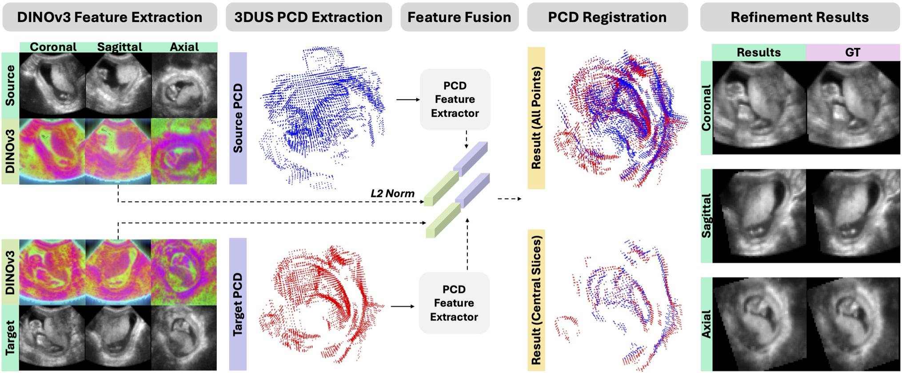
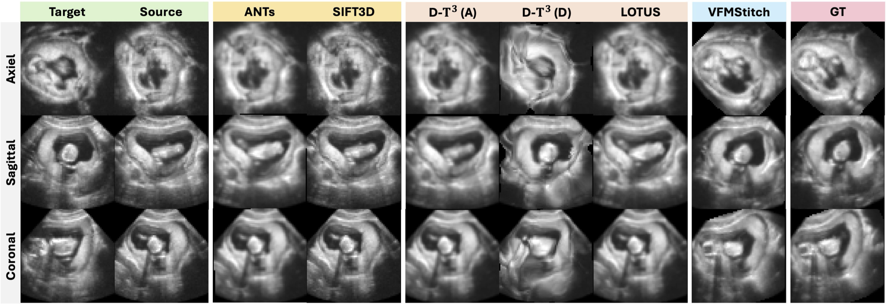
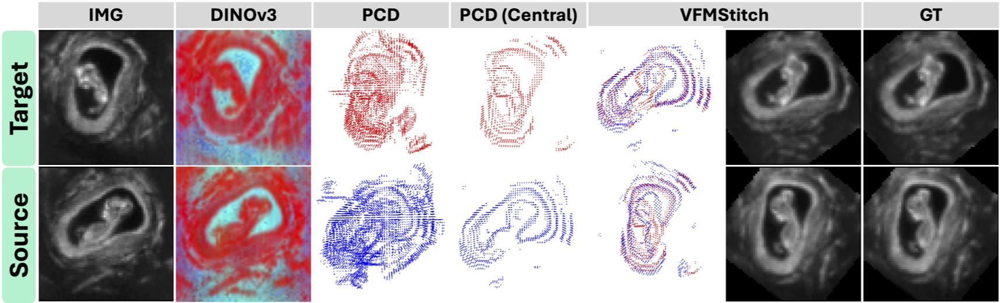
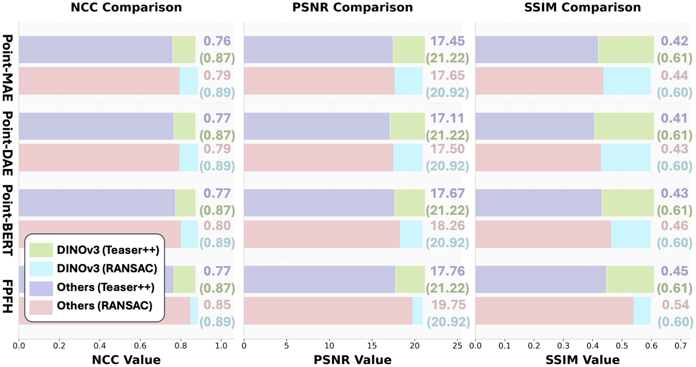
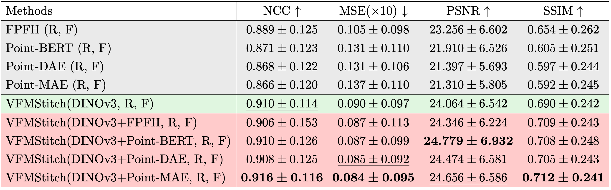
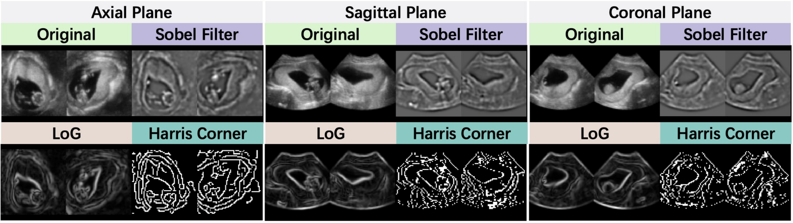
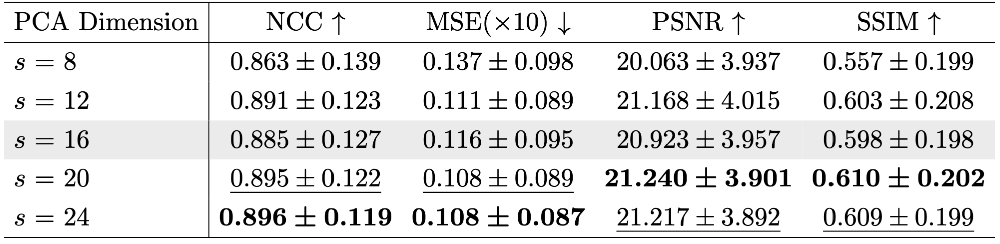
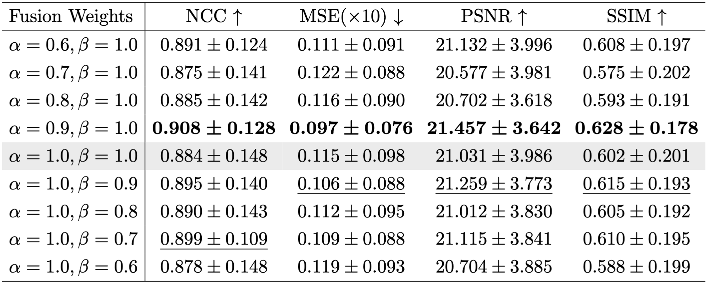
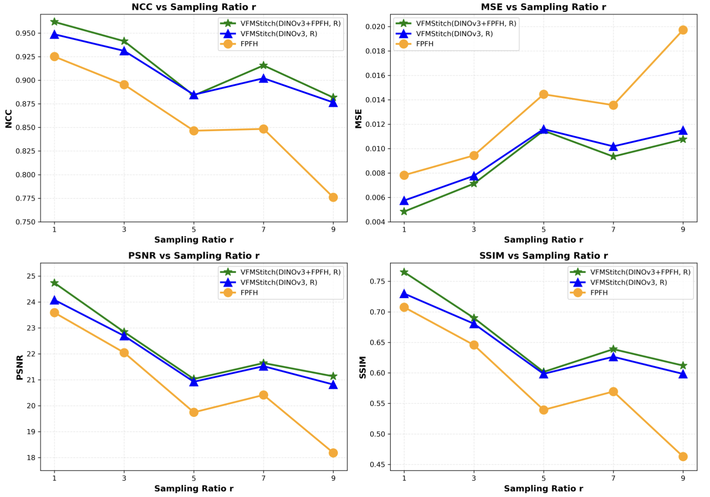

# VFMStitch: A Vision-Foundation-Model Empowered Framework for 3D Ultrasound Stitching via Geometric–Semantic Feature Fusion

[](https://openreview.net/forum?id=nILVbV4aAZ#discussion)

VFMStitch is a training-free 3D ultrasound registration framework that fuses vision foundation model (DINOv3)-derived semantic features with point-cloud-based geometric features to handle large inter-volume motion. The work has been accepted at MIDL 2026.



This work builds upon our prior work PCD-based registration framework [](https://www.spiedigitallibrary.org/conference-proceedings-of-spie/13925/139252F/From-geometry-to-intensity--a-coarse-to-fine-pipeline/10.1117/12.3086611.short).

##

Our work can be summarized as follows: \
(a) VFMStitch is the first framework to leverage VFM-derived features for medical image registration involving large rigid transformations, filling a critical gap left by existing deformable-focused VFM approaches. \


(b) We show that PCD-based registration serves as a reliable and robust alternative to intensity-based registration for 3DUS stitching, particularly in the presence of strong noise and artifacts. 



(c) We demonstrate that DINOv3-based semantic features significantly outperform traditional and learning-based descriptors when used as PCD registration features. \


(d) Our results further reveal that fusing geometric and semantic cues yields additional performance gains, highlighting the complementary nature of these representations. \


The details of our methods and results can be viewed in the paper.

## Installation

This project depends on the official DINOv3 repository and also requires additional environments for medical image processing and point cloud processing, please follow the instructions to set up the envs:

### DINOv3

This project **depends on the official DINOv3 implementation**. You **need** to install DINOv3 and its dependencies by following the **official** instructions in the upstream repository:

- **DINOv3 (official)**: `https://github.com/facebookresearch/dinov3`

Do not assume this repository vendors DINOv3; clone and set up that project as documented there.

### Additional stack

Besides PyTorch, this pipeline uses:

- **Medical imaging (NIfTI)**: e.g. NiBabel, and related I/O / volume utilities as used in the scripts.
- **Point clouds**: e.g. Open3D and other PCD-related libraries used in registration and conversion.

### Recommended environment layout

The author used **two separate conda environments**:

1. **`dinov3`**: for installing and running the official DINOv3 code and for **DINOv3 feature extraction** (`preprocess/extract_dino_ft_nii.py`).
2. **`gen_env`**: for **NIfTI preprocessing**, **masking**, **voxel-to-PCD**, and **registration** (image + point cloud stack).

You may **merge** dependencies into a **single** environment if you can reconcile versions (Python, CUDA, PyTorch, Open3D, etc.), or **keep two environments** and run each step in the appropriate one. The former is convenient; the latter often avoids dependency friction.

### Pinned dependencies (optional)

Pip-pinnable packages were exported from the author’s environments (`gen_env` and `dinov3`) on this machine and saved as:

- `requirements.txt` — index and usage notes
- `requirements-gen_env.txt` — lockfile-style list for the general **preprocess + registration** stack
- `requirements-dinov3.txt` — lockfile-style list for the **DINOv3** feature environment

Use these as **reference**; you may need to adjust versions for your OS, CUDA, and PyTorch build. Re-export after major upgrades:

```bash
conda activate gen_env
pip list --format=freeze | grep '==' | grep -v '@' | sort > requirements-gen_env.txt

conda activate dinov3
pip list --format=freeze | grep '==' | grep -v '@' | sort > requirements-dinov3.txt
```

---

## Getting Started

### Step 1: Organize input data

Place all input volumes in **one folder**. Use a consistent **A / B pair** naming pattern so each pair is registered together, for example:

- `name1A.nii.gz`, `name1B.nii.gz`
- `name2A.nii.gz`, `name2B.nii.gz`

The folder should contain only (or at least) the `.nii.gz` files you wish to process. Each **A/B** pair denotes two images to be registered.

### Step 2: Run the full preprocessing pipeline

After you git clone the repo and enter the main folder, run the end-to-end script:

```bash
python preprocess/nii_process/whole_preprocess_pipeline.py
```

(Adjust `python` / paths according to your environment and working directory; run from the repository root when paths are relative.)

The pipeline typically performs:

- Reorientation to **LPS**
- **Gaussian smoothing**
- **Resampling**
- **Padding** and **cropping**
- **Reset origin** to `(0, 0, 0)`
- **Intensity normalization** to `[0, 1]`

**Note:** the code sets the output NIfTI header **spacing to `(1, 1, 1)`** for simplicity in later steps. The **stored spacing is not the true physical spacing** of the resampled volume; use your own records if you need real-world units downstream.

### Step 3: Foreground mask extraction

```bash
python preprocess/nii_process/mask_generation_erosion.py
```

This step **estimates foreground masks** and applies **erosion** to reduce boundary artifacts in later stages.

### Step 4: Convert volume to point cloud

```bash
python preprocess/voxel2pcd/vox2pc_color.py
```

This step **builds edge-related cues** from the NIfTI data and masks and **converts** them into **colored point clouds** for registration.

**Edge features:** implementation also lives under `preprocess/edge_features/`, but you **do not** need to run those modules manually—they are **invoked from** the voxel-to-PCD pipeline as integrated steps.



### Step 5: Install DINOv3

You **need**:

- **Clone** the official **DINOv3** repository.
- **Download** the **pretrained weights** as described upstream.

Follow the **official** setup guide (same placeholder as above):

- `https://github.com/facebookresearch/dinov3`

### Step 6: Extract DINOv3 features

```bash
python preprocess/extract_dino_ft_nii.py
```

This step **extracts DINOv3** semantic **features** from the preprocessed 3D ultrasound volumes (in the DINOv3-appropriate environment).

### Step 7: Registration

```bash
python reg/dinov3_pcd_reg_new.py
```

The script supports **four** modes (see the code / CLI for exact flags and defaults):

1. **FPFHOnly** — **geometry only**: FPFH-style point cloud features.
2. **DinoOnly** — **semantics only**: DINOv3-based features.
3. **Sequential** — **FPFH → DINO** with **ICP**-style refinement afterward.
4. **Fusion** — **combines** FPFH and DINO features in one pipeline.

---

## Hyperparameter Selection

Several hyperparameters have a **substantial** effect on registration **quality**. In particular, pay attention to:

- **PCA dimension**
- **Fusion weights** (α and β)
- **Voxel sampling factor**

**All of these** influence the final registration outcome. Among them, the **voxel sampling factor** typically has the **largest** impact on robustness and accuracy.

- **PCA dimension** — controls **feature compression** in the PCA subspace and therefore **representation** quality of the features used for matching. \

- **Fusion weights (α, β)** — set the **balance** between **geometric** (FPFH) and **semantic** (DINOv3) components when the pipeline combines both. \

- **Voxel sampling factor** — controls **point-cloud density** (how volume samples become points); it has a **strong** effect on **robustness** and **alignment** accuracy.



Depending on your **acquisition** setup, **noise**, and **anatomy**, you may need to **tune** these settings; treat the defaults in the code as a starting point rather than a one-size-fits-all choice.

---

## Additional notes

- The workflow targets **3D ultrasound** data and assumptions in preprocessing reflect that setting.
- The design is **modular**: each stage can be run and **debugged** on its own, which eases ablations and failure isolation.
- For project-specific options (paths, modes, and hyperparameters), refer to the scripts above and their argument parsers.

---

## Citation

If you use our ideas/code in your research, please use the following BibTeX entry.

```
@inproceedings{yao2026vfmstitch,
  title={VFMStitch: A Vision-Foundation-Model Empowered Framework for 3D Ultrasound Stitching via Geometric--Semantic Feature Fusion},
  author={Yao, Xing and DiSanto, Nick and Yu, Runxuan and Wang, Jiacheng and Lu, Daiwei and Arenas, Gabriel A and Oguz, Baris and Pouch, Alison Marie and Schwartz, Nadav and Byram, Brett and Oguz, Ipek},
  booktitle={Medical Imaging with Deep Learning},
  year={2026}
}
```
```
@inproceedings{yao2026geometry,
  title={From geometry to intensity: a coarse-to-fine pipeline for unsupervised 3D ultrasound stitching},
  author={Yao, Xing and Yu, Runxuan and Lu, Daiwei and DiSanto, Nick and Aghdam, Ehsan K and Oguine, Kanyifeechukwu and Arenas, Gabriel and Oguz, Baris and Pouch, Alison and Schwartz, Nadav and Oguz, Ipek},
  booktitle={Medical Imaging 2026: Image Processing},
  volume={13925},
  pages={655--660},
  year={2026},
  organization={SPIE}
}
```